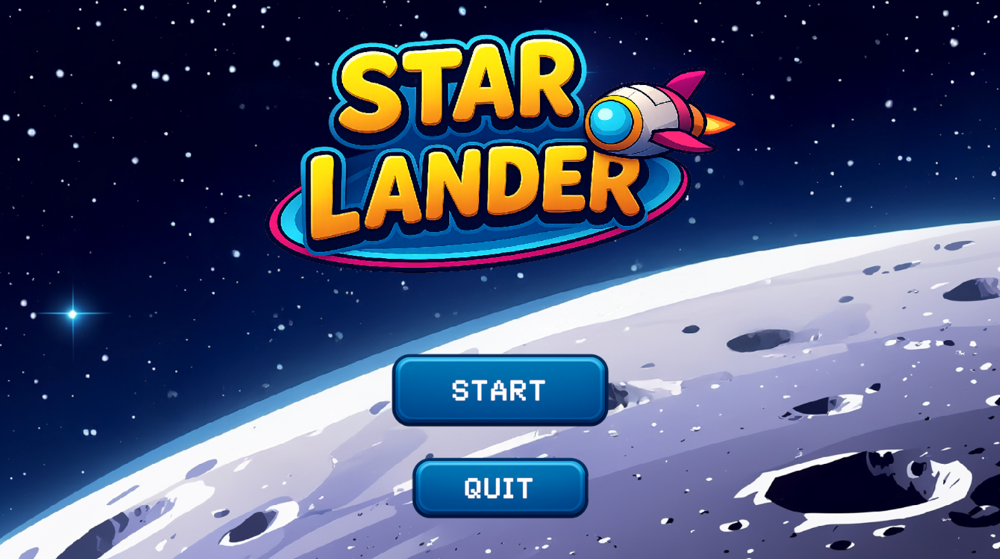

# 🎯 2D Game

  

🚀 **Star Lander** is a fun and fast-paced 2D game where your mission is simple:  
**Collect coins 🪙, dodge enemies 👾 and obstacles ⚠, and land safely 🛬!**

---

## 🎮 Gameplay

- **Collect Coins** 🪙 – Grab as many coins as possible to boost your score.
- **Avoid Hazards** ⚠ – Enemies and traps are everywhere, don’t get caught!
- **Land on Target** 🎯 – Reach the safe zone to complete the level.

---

## 🛠 Tech Stack

| Tool / Service        | Purpose               |
| --------------------- | --------------------- |
| **Unity Game Engine** | Core game development |
| **C#**                | Game logic scripting  |

---

## 📸 Screenshots

---
